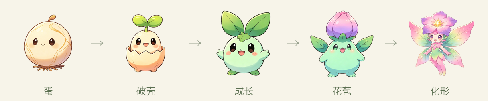
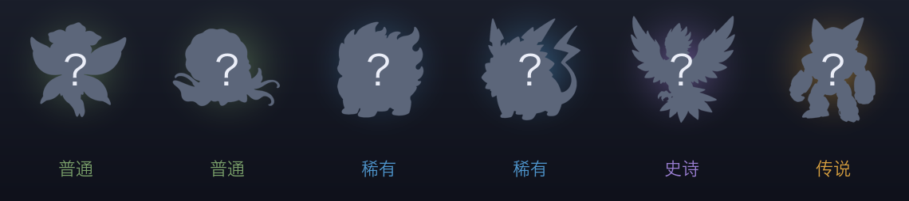

<div align="center">

# 🌱 Token 小精灵

**用你真实烧掉的 AI 编程 token，孵化、养成、集齐一整墙小精灵。**

一只养在桌面角落的桌宠（macOS / Windows / Linux 通吃）—— 你每写一段代码，它就在悄悄进化。
全程只读本地用量，**不联网、不上传**。

</div>

---

## 🥚 孵化 = 一路进化

选一颗蛋，它吃你的 token，从蛋一路长到**化形**，收进图鉴。

<div align="center">

</div>

## 👾 6 只精灵，破壳才揭晓是谁

达成成就攒券 → 抽卡开出**不同稀有度的蛋** → 孵化养成 → 集齐图鉴。

<div align="center">

</div>

> 草木、海洋、岩浆、雷电、冰晶、机械 —— 每只都有自己的 5 段进化线。你会先抽到谁？

## ✨ 它凭什么不一样

- **真实劳动养出来**：读本地 **Claude Code / Codex** 的真实 token 用量，装不出、刷不了。
- **会陪你**：连写久了劝你歇口气、深夜提醒早点睡、久别重逢招手 —— 从"被看"变"陪你"。
- **桌宠**：悬浮置顶、可拖动，还能收成"侧边探头"不占地方。
- **越集越上头**：成就 → 抽卡 → 孵化 → 图鉴，收集驱动。
- **全本地私密**：数据只在你电脑本地读取。

## 🏆 成就 → 🎴 抽卡

**达成成就得券，用券抽蛋** —— 全部用你的真实本地用量判定，写代码就是玩。

| 成就 | 条件 | 奖励 |
|---|---|---|
| 初出茅庐 | 累计 1B token | 🟢 普通券 |
| 双修 | 任意两个工具各累计 ≥ 300M | 🟢 普通券 |
| 昼夜不息 | 深夜（0–6 点）写代码满 3 天 | 🟢 普通券 |
| 爆种 | 单日破 2B | 🔵 稀有券 |
| 一周不辍 | 连续开工 7 天 | 🔵 稀有券 |
| 里程碑 | 连续 30 天 · 或累计 10B | 🟣 史诗券 |
| 传说之路 | 累计破 100B | 🟡 传说券 |

**抽卡规则**：一张券**大概率开出对应稀有度**，**15% 小概率升一档**（不跳档、不降档，传说封顶）。所以普通券最多升到稀有，史诗只能从稀有/史诗券里来。

抽到的是一颗**蛋**，放进孵化器、用 token 从蛋一路养到**化形**才算集齐。稀有度越高，孵化要喂的越多：

| 稀有度 | 孵化门槛（安装以来喂的 token） |
|---|---|
| 🟢 普通 | 0.5B |
| 🔵 稀有 | 2B |
| 🟣 史诗 | 8B |
| 🟡 传说 | 30B |

> 数值都在 `src/config/`（`achievements.js` / `rarities.js`）里，想调平衡改一处即可。

## 🚀 快速开始

需要 [Node.js](https://nodejs.org/) 20+。**macOS / Windows / Linux 都能跑**（macOS 支持 Intel / Apple 芯片通用）。

```bash
git clone https://github.com/shiyubao78/token-sprite.git
cd token-sprite
npm install
npm start
```

`npm start` 自动编译并启动，小精灵出现在桌面右下角。

### 🤖 或者一句话让 agent 帮你装

仓库带了 `AGENTS.md` / `CLAUDE.md`，直接对 Claude Code、Codex 说：

> “把 github.com/shiyubao78/token-sprite clone 下来，在我桌面跑起来。”

## 🧩 它怎么工作

**自动检测**你本地装了哪些 AI 工具，能读到 token 的就统计、没装的自动跳过：

| 工具 | 读取位置 |
|---|---|
| Claude Code | `~/.claude/projects/**/*.jsonl` |
| Codex | `~/.codex/**/rollout-*.jsonl` |

安装那刻记一个基准，之后**从 0 开始养** —— 你写多少，它长多少。

> 只能统计把 token **写在本地、可解析**的工具（多为 CLI）；豆包 / Cursor / Trae / DeepSeek / Kimi 这类用量在服务端、本地无数据，**任何本地工具都读不到**。

### 想让它认出你的工具？加一个读取器（十行）

用了别的会写本地日志的 CLI（Gemini CLI、OpenCode、Aider…）？在 `scripts/usage.mjs` 的 `READERS` 里照着加一段即可，装了就自动纳入、没装自动跳过：

```js
async function readYourTool() {
  const root = join(homedir(), '.yourtool');
  if (!(await exists(root))) return null;           // 没装 → 跳过
  let total = 0, recentTokens = 0, todayTokens = 0, lastActivityAt = 0;
  // 遍历该工具的本地日志，累加 token、记录最近/今日/时间戳……
  return { total, recentTokens, todayTokens, lastActivityAt };
}
export const READERS = [
  /* …已有的 Claude Code、Codex… */
  { source: 'yourtool', label: 'Your Tool', read: readYourTool },
];
```

💡 因为你多半也在用 AI agent，可以直接让它帮你写：**“看看我本地 &lt;工具&gt; 的用量日志格式，给 token-sprite 的 `scripts/usage.mjs` 加一个读取器。”** 欢迎 PR 回来惠及大家。

## 📦 打包成桌面应用（三系统通用）

在对应系统上跑对应命令，产物都在 `release/`：

```bash
npm run pack         # macOS → release/mac-universal/Token小精灵.app
npm run pack:win     # Windows → 免安装 .exe + NSIS 安装包
npm run pack:linux   # Linux → AppImage（直接双击运行）
```

> 打包只能在**目标系统本机**进行（Windows 包在 Windows 上打、Linux 包在 Linux 上打）。不想自己配环境，也可以直接用仓库自带的 GitHub Actions：在 Actions 页点 **Build desktop apps → Run workflow**，三个系统的安装包会自动打好、在产物里下载。

各系统小提示：

- **macOS**：未签名、Intel / Apple 通用。首次打开若被拦，右键 →「打开」一次即可。打包后默认开启开机自启（菜单里可关）。
- **Windows**：未签名，SmartScreen 拦截时点「更多信息 → 仍要运行」。也支持开机自启。
- **Linux**：给 AppImage 加执行权限后运行（`chmod +x *.AppImage`）。桌宠的透明/置顶效果依赖你的桌面环境（GNOME、KDE 等主流都可）；开机自启在 Linux 上不提供开关（各发行版方式不一）。

## 🔧 自定义

- 品种、稀有度、名字、图路径：`src/config/species.js`
- 成就、门槛、抽卡概率：`src/config/achievements.js` / `src/config/rarities.js`
- 换形象：把 5 段图放进 `assets/sprite/<品种>/`（`1-seed` … `5-adult`，512 透明 PNG）

## 📄 License

MIT，见 [LICENSE](LICENSE)。内置形象为 AI 生成，仅作示例，可自行替换。
