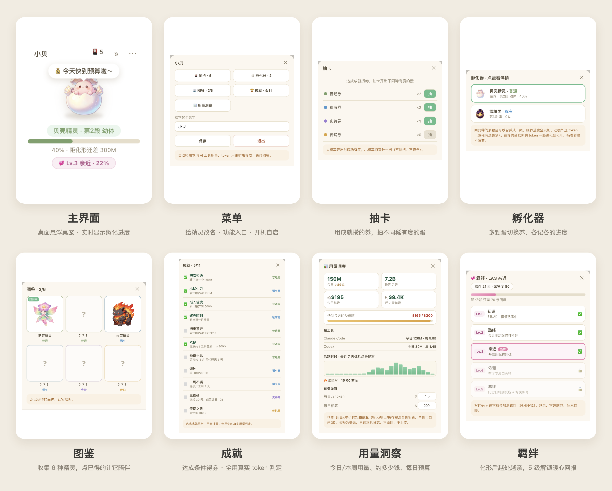

<div align="center">

# 🌱 Token 小精灵 / Token Sprite

**你写下的每个 Token，都在让它长大。**<br />
**Every token you write helps it grow.**

把真实的 AI 编程用量变成一只住在桌面角落、一路破壳进化的小精灵——化形后和你结下羁绊，还顺手告诉你写了多少、花了多少。<br />
Turn your real AI-coding usage into a tiny desktop companion that hatches, evolves, and bonds with you—while showing how much you have written and roughly spent.


### `CODE → HATCH → EVOLVE → COLLECT`

写代码获得真实 Token → 达成成就抽精灵蛋 → 五段进化 → 收进图鉴。<br />
Write code, earn real tokens, hatch mystery eggs, evolve through five stages, and complete your collection.

**macOS · Windows · Linux** · 本地读取 / Local-only · 不上传 / Nothing uploaded

</div>

---

## 🥚 孵化与进化 / Hatch & Evolve

选一颗蛋，它会吸收你真实使用掉的 Token，从破壳一路成长到最终化形。<br />
Choose an egg and feed it with the tokens you actually use, from first crack to final form.

<div align="center">

</div>

六种属性、六条完整进化线：草木、海洋、岩浆、雷电、机械与冰晶。破壳前，你永远不知道会遇见谁。<br />
Six elements, six complete evolution lines: flora, ocean, magma, thunder, mech, and ice. You will not know who is inside until the egg hatches.

抽到重复的同类蛋？在孵化器里一键**合并**——喂养进度全累加，还按稀有度额外送 token，加速孵一只喜欢的。<br />
Got duplicate eggs of the same species? **Merge** them in the incubator—progress stacks and you earn bonus tokens by rarity, fast-tracking a favorite.

## ✨ 为什么特别 / Why It’s Different

- **真实劳动养出来 / Powered by real work**：读取本地 AI 编程工具的真实 Token 用量，写多少就长多少。 / It grows from your actual local AI-coding usage.
- **会陪你 / A companion, not a counter**：连续工作会劝你休息，深夜会提醒早点睡，久别重逢会向你招手；化形后还会和你结下**羁绊**，越写越亲。 / It nudges you to rest, sleep, and come back—and after final form it forms a growing **bond** with you the more you code.
- **看得见用量和花费 / See usage and cost**：用量洞察面板显示今日/近 7 天写了多少 token、按工具占比、活跃时段，还能折算**约多少钱**并设每日预算提醒（美元、粗略估算）。 / A panel breaks down tokens by day, tool, and hour, converts them into a **rough dollar cost**, and can warn you when you pass a daily budget.
- **桌面常驻 / Always on your desktop**：悬浮置顶、自由拖动，也能缩成侧边探头。 / Always on top, draggable, and able to peek quietly from the screen edge.
- **孵化收集 / Hatch and collect**：成就 → 抽蛋 → 进化 → 图鉴，让每次写代码都有期待。 / Achievements unlock eggs; eggs evolve into creatures for your collection.
- **全本地私密 / Private by design**：只读本机日志，用量绝不上传；仅正式版会向 GitHub 查询有无新版本。 / Usage stays on your machine and is never uploaded; only released builds check GitHub for new versions.

## 🏆 成就与抽蛋 / Achievements & Hatching

达成成就获得抽蛋券；每张券大概率开出对应稀有度，并有 **15%** 概率提升一档。**新手期门槛低、发券快**，前几天就能集齐前 4 只、挑一只重点养。<br />
Complete achievements to earn egg tickets. Each ticket usually matches its rarity, with a **15%** chance to upgrade by one tier. **Early achievements are quick**, so you can collect the first few species in days and pick a favorite.

| 成就 / Achievement | 条件 / Requirement | 奖励 / Reward |
|---|---|---|
| 初次相遇 / First Meeting | 敲下第一个 token / Your first token | 🟢 普通 / Common |
| 小试牛刀 / Warming Up | 累计 100M / 100M total | 🔵 稀有 / Rare |
| 渐入佳境 / Getting There | 累计 500M / 500M total | 🟢 普通 / Common |
| 破壳时刻 / First Hatch | 孵出第一只精灵 / Hatch your first | 🔵 稀有 / Rare |
| 初出茅庐 / First Steps | 累计 1B Token / 1B total tokens | 🟢 普通 / Common |
| 双修 / Dual Wielder | 两个工具各累计 ≥ 300M / 300M+ in two tools | 🟢 普通 / Common |
| 昼夜不息 / Night Coder | 深夜写代码满 3 天 / Code overnight on 3 days | 🟢 普通 / Common |
| 爆种 / Overdrive | 单日破 2B / 2B in one day | 🔵 稀有 / Rare |
| 一周不辍 / Seven-Day Streak | 连续开工 7 天 / 7-day streak | 🔵 稀有 / Rare |
| 里程碑 / Milestone | 连续 30 天或累计 10B / 30 days or 10B total | 🟣 史诗 / Epic |
| 传说之路 / Path to Legend | 累计破 100B / 100B total | 🟡 传说 / Legendary |

抽到的是一颗蛋。放进孵化器继续写代码，完成五段进化才会正式收进图鉴。<br />
Every draw gives you an egg. Keep coding to complete all five stages and add its final form to your collection.

| 稀有度 / Rarity | 孵化所需 Token / Tokens to Hatch |
|---|---:|
| 🟢 普通 / Common | 0.5B |
| 🔵 稀有 / Rare | 2B |
| 🟣 史诗 / Epic | 8B |
| 🟡 传说 / Legendary | 30B |

> 数值可在 `src/config/achievements.js` 与 `src/config/rarities.js` 调整。<br />
> Balance values live in `src/config/achievements.js` and `src/config/rarities.js`.

## 🖥️ 界面一览 / A Look Inside

全本地、免登录，一个悬浮小窗搞定：改名、抽卡、孵化、图鉴、成就、用量洞察，还有化形后的羁绊。<br />
Fully local, no login — one floating window: rename, draw, hatch, collect, earn achievements, track usage & cost, and bond after final form.

<p align="center">

</p>

| 界面 / Panel | 能做什么 / What you do |
|---|---|
| 🏠 主界面 / Main | 桌面悬浮桌宠，实时显示孵化进度（精确到 0.01%）/ Floating pet with live hatch progress (down to 0.01%) |
| ⚙️ 菜单 / Menu | 给精灵改名、进入各功能、开关开机自启 / Rename your sprite, open features, toggle auto-launch |
| 🎴 抽卡 / Gacha | 用成就攒的券抽不同稀有度的蛋 / Spend achievement tickets to draw eggs of varying rarity |
| 🥚 孵化器 / Incubator | 多颗蛋切换养，各记各的进度、不清零 / Raise multiple eggs, each keeps its own progress |
| 📖 图鉴 / Collection | 收集 6 种精灵，点已获得的让它陪伴 / Collect 6 species; tap an owned one to make it your companion |
| 🏆 成就 / Achievements | 达成条件得券，全用真实 token 用量判定 / Earn tickets by hitting milestones, all judged on real token usage |
| 📊 用量洞察 / Usage | 今日 / 最近 7 天用量、按工具占比、活跃时段，还有花费估算与每日预算 / Today & 7-day usage, per-tool split, active hours, plus cost estimate and daily budget |
| 💞 羁绊 / Bond | 化形后开启，写代码 + 逗它越处越亲，5 级解锁暖心回报 / Unlocks after final form; coding and play deepen a 5-level bond |

## 📊 用量洞察与花费 / Usage & Cost Insights

菜单 → **用量洞察**：看今日 / 最近 7 天写了多少 Token、每个工具各占多少、你几点最能写。还能把用量折成**约多少钱**（粗略估算，每百万 token 的单价可自己调），并设一个**每日预算**——当天估算花费到 80% 或超 100% 时，小精灵会冒泡提醒你。全部只读本机日志，不联网、不上传。<br />
Open **Usage Insights** from the menu to see how many tokens you wrote today and over the last 7 days, each tool's share, and your most productive hours. It also turns usage into a **rough cost estimate** (with an adjustable per-million rate) and lets you set a **daily budget**—your sprite gently reminds you when the day's estimate hits 80% or goes over 100%. Everything is read from local logs only, never uploaded.

化形之后，陪伴不止：随着你写代码和逗它，**羁绊**会一路升级，解锁更亲昵的反应。<br />
After it reaches its final form, the bond continues: coding and playful pokes level up your **bond**, unlocking warmer reactions over time.

## 🚀 快速开始 / Quick Start

需要 [Node.js](https://nodejs.org/) 20+，支持 **macOS、Windows 与 Linux**。<br />
Requires [Node.js](https://nodejs.org/) 20+ and runs on **macOS, Windows, and Linux**.

### macOS 普通用户安装 / Install on macOS

普通用户请从 GitHub Releases 下载最新的 `.zip`，解压后把 **Token 小精灵**拖进“应用程序”。当前为未签名版本，首次打开右键点图标选“打开”通过一次系统提示即可。源码方式主要面向开发者。<br />
Download the latest `.zip` from GitHub Releases, unzip it, and drag **Token Sprite** into Applications. Current builds are unsigned, so right-click the app and choose “Open” once to pass Gatekeeper. The source workflow below is mainly for developers.

有新版时，正式版会弹窗提醒；菜单栏的小精灵图标 → **检查更新** 也会打开下载页，下载新版 `.zip` 解压覆盖安装即可，成长数据保留。<br />
When a new version is available, released builds show a reminder. The menu-bar icon → **Check for Updates** opens the download page; grab the new `.zip`, unzip, and reinstall over the old one—your growth data is kept.

如果小精灵不在桌面上，点击菜单栏的小精灵图标 → **召回小精灵**。显示器拔插、分辨率变化或睡眠恢复后，如果窗口完全跑出屏幕，应用也会自动把它带回来。<br />
If your sprite disappears, choose **Recall Sprite** from its menu-bar icon. It also returns automatically after display changes or wake when its window is fully off-screen.

### 从源码运行 / Run from source

```bash
git clone https://github.com/shiyubao78/token-sprite.git
cd token-sprite
npm install
npm start
```

启动后，小精灵会出现在桌面右下角。<br />
Once started, your sprite appears in the bottom-right corner of the desktop.

### 🤖 一句话让 Agent 帮你装 / Let Your Agent Install It

把下面这句话直接发给 Codex、Claude Code 或其他能操作终端的 Agent：<br />
Send this directly to Codex, Claude Code, or any terminal-capable agent:

> 帮我安装并运行 github.com/shiyubao78/token-sprite<br />
> Install and run github.com/shiyubao78/token-sprite for me.

仓库内置 `AGENTS.md` 与 `CLAUDE.md`，Agent 可以自动完成克隆、安装与启动。<br />
The repository includes `AGENTS.md` and `CLAUDE.md`, so an agent can clone, install, and launch it for you.

### 🔄 一句话让 Agent 帮你更新 / Let Your Agent Update It

想升级到最新版，同样发一句话给 Agent 即可，成长数据会保留：<br />
To upgrade to the latest version, just send your agent one line—your growth data is kept:

> 帮我把 token-sprite 更新到最新版<br />
> Update token-sprite to the latest version for me.

源码方式安装的，Agent 会 `git pull` 最新代码并重装启动；下载安装版的，Agent 会取最新 Release 覆盖旧版。<br />
For source installs the agent runs `git pull` and reinstalls; for downloaded builds it fetches the latest release and replaces the old app.

## 🧩 工作原理 / How It Works

应用会自动检测本机支持的 AI 工具，读取本地日志中的 Token 用量。没安装的工具会自动跳过，数据不会离开你的电脑。<br />
The app detects supported AI tools and reads token usage from local logs. Missing tools are skipped automatically, and your data never leaves your computer.

| 工具 / Tool | 本地读取位置 / Local Data Source |
|---|---|
| Claude Code | `~/.claude/projects/**/*.jsonl` |
| Codex | `~/.codex/**/rollout-*.jsonl` |

安装时会记录基准，此后从 0 开始养；你新使用多少 Token，它就成长多少。<br />
A baseline is recorded on installation. Only new usage counts toward your sprite’s growth.

> 只能统计在本地保存可解析用量日志的工具。服务端用量无法从本机读取。<br />
> Only tools that store parseable usage logs locally can be counted. Cloud-only usage is not accessible.

### 添加其他工具 / Add Another Tool

如果 Gemini CLI、OpenCode、Aider 等工具会把用量写进本地日志，可以在 `scripts/usage.mjs` 的 `READERS` 中增加读取器：

```js
async function readYourTool() {
  const root = join(homedir(), '.yourtool');
  if (!(await exists(root))) return null;
  let total = 0, recentTokens = 0, todayTokens = 0, lastActivityAt = 0;
  // 遍历本地日志并累加用量 / Parse local logs and accumulate usage.
  return { total, recentTokens, todayTokens, lastActivityAt };
}

export const READERS = [
  /* existing readers */
  { source: 'yourtool', label: 'Your Tool', read: readYourTool },
];
```

也可以直接让你的 Agent 完成：<br />
You can also ask your agent to do it:

> 查看我本地 `<工具>` 的用量日志格式，为 token-sprite 添加读取器。<br />
> Inspect my local `<tool>` usage logs and add a reader to token-sprite.

## 📦 打包桌面应用 / Package the Desktop App

在目标系统上运行对应命令，产物会写入 `release/`：<br />
Run the matching command on the target operating system. Builds are written to `release/`.

```bash
npm run pack         # macOS universal app
npm run pack:mac:release # macOS universal DMG + ZIP + update metadata
npm run pack:win     # Windows portable app + installer
npm run pack:linux   # Linux AppImage
```

- **macOS 本地构建**：没有 Developer ID 凭证时仍是未签名版本，首次运行可能需要右键选择“打开”。正式 Release 必须经过签名和 Apple 公证。
- **Windows**：SmartScreen 拦截时选择“更多信息 → 仍要运行”。
- **Linux**：先为 AppImage 添加执行权限；透明和置顶效果取决于桌面环境。
- Packaging must run on its target OS. GitHub Actions can also build all three platforms.

## 🔧 自定义 / Customize

- 品种、稀有度、名称、图片路径 / Species, rarity, names, and artwork: `src/config/species.js`
- 成就、门槛、抽卡概率 / Achievements, thresholds, and odds: `src/config/achievements.js`, `src/config/rarities.js`
- 自定义形象 / Custom artwork: `assets/sprite/<species>/1-seed.png` … `5-adult.png`

每个阶段使用 512×512 透明 PNG。<br />
Each stage uses a 512×512 transparent PNG.

## 📄 License

**非商业授权 / Noncommercial.** 本项目禁止商业使用。<br />
- 源代码 / Source code: [PolyForm Noncommercial 1.0.0](LICENSE)
- 美术素材 / Art assets（`assets/**`）: [CC BY-NC 4.0](assets/LICENSE.md)

可自由用于个人、学习、非营利用途；使用素材需署名。内置形象为 AI 生成，仅作示例，可自行替换。<br />
Free for personal, educational, and nonprofit use; assets require attribution. Built-in artwork is AI-generated as an example and can be replaced.
