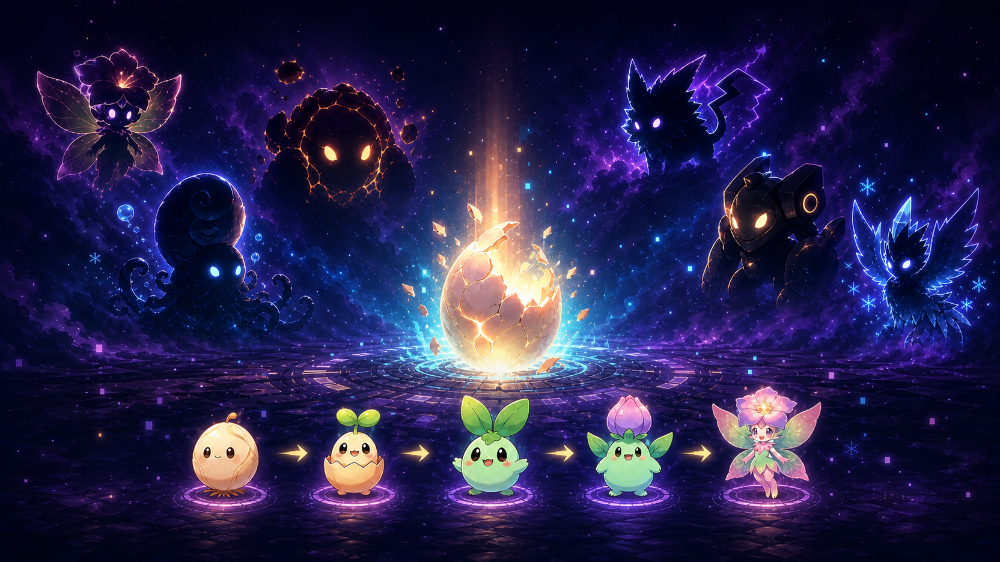
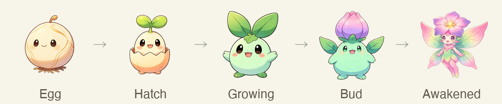
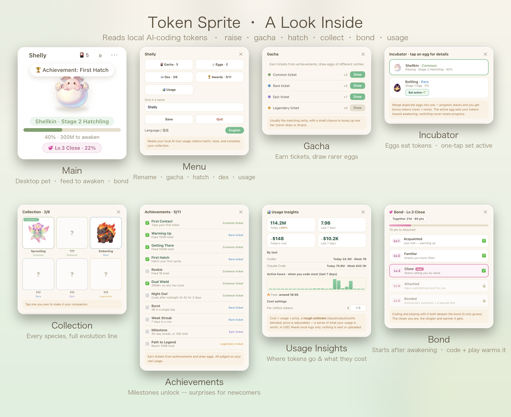

<div align="center">

# 🌱 Token Sprite

**English · [中文](README.zh-CN.md)**

**Every token you write helps it grow.**

Turn your real AI-coding usage into a tiny desktop companion that hatches, evolves, and bonds with you — while showing how much you've written and roughly spent.



### `CODE → HATCH → EVOLVE → COLLECT`

Write code, earn real tokens, hatch mystery eggs, evolve through five stages, and complete your collection.

**macOS · Windows · Linux** · Local-only · Nothing uploaded

</div>

---

## 🥚 Hatch & Evolve

Choose an egg and feed it with the tokens you actually use, from first crack to final form.

<div align="center">

</div>

Six elements, six complete evolution lines: flora, ocean, magma, thunder, mech, and ice. You won't know who's inside until the egg hatches.

Got duplicate eggs of the same species? **Merge** them in the incubator — progress stacks and you earn bonus tokens by rarity, fast-tracking a favorite.

## ✨ Why It's Different

- **Powered by real work** — it grows from your actual local AI-coding token usage. Write more, grow more.
- **A companion, not a counter** — it nudges you to rest, reminds you to sleep late at night, and waves when you return. After its final form it forms a growing **bond** with you the more you code.
- **See usage and cost** — a Usage Insights panel breaks tokens down by day, tool, and hour, and converts them into a **rough dollar value** of what you've used.
- **Always on your desktop** — floating, always on top, draggable, and able to peek quietly from the screen edge.
- **Hatch and collect** — achievements unlock eggs; eggs evolve into creatures for your collection.
- **Bilingual** — full **English & 中文**, switch anytime from the menu. Follows your system language by default.
- **Private by design** — usage stays on your machine and is never uploaded; only released builds check GitHub for new versions.

## 🏆 Achievements & Hatching

Complete achievements to earn egg tickets. Each ticket usually matches its rarity, with a **15%** chance to upgrade by one tier. **Early achievements are quick**, so you can collect the first few species in days and pick a favorite.

| Achievement | Requirement | Reward |
|---|---|---|
| First Contact | Type your first token | 🟢 Common |
| Warming Up | 100M total | 🔵 Rare |
| Getting There | 500M total | 🟢 Common |
| First Hatch | Hatch your first sprite | 🔵 Rare |
| Rookie | 1B total tokens | 🟢 Common |
| Dual Wield | 300M+ in any two tools | 🟢 Common |
| Night Owl | Code after midnight (0–6) on 3 days | 🟢 Common |
| Burst | 2B in a single day | 🔵 Rare |
| Week Streak | 7 days in a row | 🔵 Rare |
| Milestone | 30-day streak, or 10B total | 🟣 Epic |
| Path to Legend | 100B total | 🟡 Legendary |

Every draw gives you an egg. Keep coding to complete all five stages, and its final "Awakened" form joins your collection.

| Rarity | Tokens to Hatch |
|---|---:|
| 🟢 Common | 0.5B |
| 🔵 Rare | 2B |
| 🟣 Epic | 8B |
| 🟡 Legendary | 30B |

> Balance values live in `src/config/achievements.js` and `src/config/rarities.js`.

## 🖥️ A Look Inside

Fully local, no login — one floating window: rename, draw, hatch, collect, earn achievements, track usage & cost, and bond after final form.

<p align="center">

</p>

| Panel | What you do |
|---|---|
| 🏠 Main | Floating desktop pet with live hatch progress (down to 0.01%) |
| ⚙️ Menu | Rename your sprite, open features, switch language, toggle auto-launch |
| 🎴 Gacha | Spend achievement tickets to draw eggs of varying rarity |
| 🥚 Incubator | One tap to set an egg active; switch anytime, each keeps its own progress |
| 📖 Collection | Collect 6 species; tap an owned one to make it your companion |
| 🏆 Achievements | Earn tickets by hitting milestones, all judged on real token usage |
| 📊 Usage | Today & 7-day usage, per-tool split, active hours, plus a rough cost estimate |
| 💞 Bond | Unlocks after final form; coding and play deepen a 5-level bond |

## 📊 Usage & Cost Insights

Open **Usage Insights** from the menu to see how many tokens you wrote today and over the last 7 days, each tool's share, and your most productive hours. It also turns usage into a **rough dollar estimate** (with an adjustable per-million rate) so you get a feel for what your usage is worth. Everything is read from local logs only, never uploaded.

After it reaches its final form, the companionship continues: coding and playful pokes level up your **bond**, unlocking warmer reactions over time.

## 🚀 Quick Start

Requires [Node.js](https://nodejs.org/) 20+ and runs on **macOS, Windows, and Linux**.

### Install on macOS

Download the latest `.zip` from [Releases](https://github.com/shiyubao78/token-sprite/releases), unzip it, and drag **Token Sprite** into Applications. Current builds are unsigned, so right-click the app and choose **Open** once to pass Gatekeeper.

When a new version is available, released builds show a reminder. The menu-bar icon → **Check for Updates** opens the download page; grab the new `.zip`, unzip, and reinstall over the old one — your growth data is kept.

If your sprite disappears, choose **Recall Sprite** from its menu-bar icon. It also returns automatically after display changes or wake when its window is fully off-screen.

### Run from source

```bash
git clone https://github.com/shiyubao78/token-sprite.git
cd token-sprite
npm install
npm start
```

Once started, your sprite appears in the bottom-right corner of the desktop.

### 🤖 Let your agent install it

Send this directly to Codex, Claude Code, or any terminal-capable agent:

> Install and run github.com/shiyubao78/token-sprite for me.

The repository includes `AGENTS.md` and `CLAUDE.md`, so an agent can clone, install, and launch it for you. To upgrade later, just ask it to update token-sprite — your growth data is kept.

## 🧩 How It Works

The app detects supported AI tools and reads token usage from local logs. Missing tools are skipped automatically, and your data never leaves your computer.

| Tool | Local Data Source |
|---|---|
| Claude Code | `~/.claude/projects/**/*.jsonl` |
| Codex | `~/.codex/**/rollout-*.jsonl` |

A baseline is recorded on installation. Only new usage counts toward your sprite's growth.

> Only tools that store parseable usage logs locally can be counted. Cloud-only usage is not accessible.

### Add another tool

If tools like Gemini CLI, OpenCode, or Aider write usage to local logs, add a reader in the `READERS` array of `scripts/usage.mjs`:

```js
async function readYourTool() {
  const root = join(homedir(), '.yourtool');
  if (!(await exists(root))) return null;
  let total = 0, recentTokens = 0, todayTokens = 0, lastActivityAt = 0;
  // Parse local logs and accumulate usage.
  return { total, recentTokens, todayTokens, lastActivityAt };
}

export const READERS = [
  /* existing readers */
  { source: 'yourtool', label: 'Your Tool', read: readYourTool },
];
```

Or just ask your agent:

> Inspect my local `<tool>` usage logs and add a reader to token-sprite.

## 📦 Package the Desktop App

Run the matching command on the target operating system. Builds are written to `release/`.

```bash
npm run pack              # macOS universal app
npm run pack:mac:release  # macOS universal DMG + ZIP + update metadata
npm run pack:win          # Windows portable app + installer
npm run pack:linux        # Linux AppImage
```

- **macOS**: without a Developer ID certificate, builds are unsigned; right-click → **Open** the first time. Official releases should be signed and notarized.
- **Windows**: if SmartScreen blocks it, choose **More info → Run anyway**.
- **Linux**: make the AppImage executable first; transparency and always-on-top depend on your desktop environment.
- Packaging must run on its target OS. GitHub Actions can also build all three platforms.

## 🔧 Customize

- Species, rarity, names, and artwork: `src/config/species.js`
- Achievements, thresholds, and odds: `src/config/achievements.js`, `src/config/rarities.js`
- Custom artwork: `assets/sprite/<species>/1-seed.png` … `5-adult.png`

Each stage uses a 512×512 transparent PNG.

## 📄 License

**Noncommercial.** Commercial use is not permitted.

- Source code: [PolyForm Noncommercial 1.0.0](LICENSE)
- Art assets (`assets/**`): [CC BY-NC 4.0](assets/LICENSE.md)

Free for personal, educational, and nonprofit use; assets require attribution. Built-in artwork is AI-generated as an example and can be replaced.
